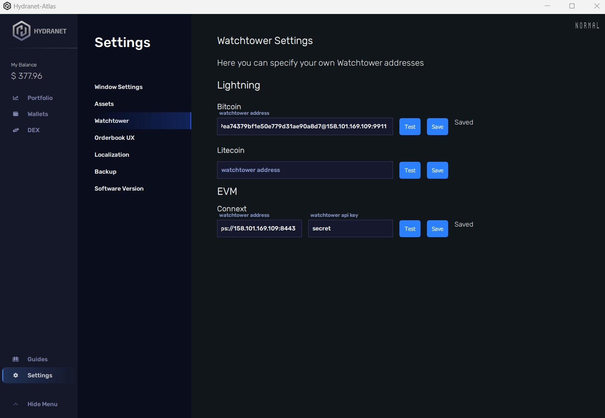
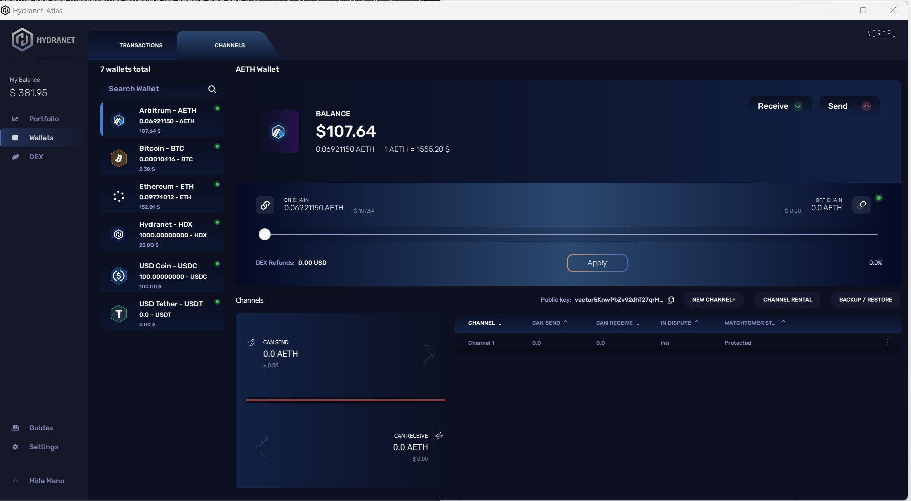

# hydranet-watchtowers
Run your own Watchtowers for the Hydranet Wallet

If you're using the Hydranet Multi Currency Lightwallet, you may be concerned about the security of your funds while your wallet is offline.
One way to improve the security of your Lightning and Vector wallet is to use Connext Vector and Lightning Watchtowers, which help prevent against certain types of attacks.
<br>
In this tutorial, we'll walk you through the steps of setting up Connext and Lightning Watchtowers on Oracle Cloud Free Tier, which offers free access to virtual machine instances that are suitable for running these workloads.
<br>
By the end of this tutorial, you'll have a fully functional Connext and Lightning Watchtower setup that can help secure your Wallet. Please note that this tutorial assumes some technical expertise, so be prepared to invest some time and effort into the process.
<br>
<br>

# Requirements:
- ### Linux server (tested with ubuntu 22.04) with a public IP
- ### Docker installation (install script provided by this repo)
- ### SSH access, Git
- ### Private key for a wallet that will be used by the watchtower 
- ### Wallet funded with Ethereum and Arbitrum Ethereum
- ### RPC provider for Ethereum and Arbitreum (e.g. Geth, Infura)
<br>

# Optional: Use Oracle Cloud Free tier
<br>
<br>


# Run the Watchtower
## Install docker
### ssh into your machine, clone this repository and install docker
```
sudo su -
git clone https://github.com/hydra-net/hydranet-watchtowers.git
cd hydranet-watchtowers
bash install-docker.sh
```
### This script will update your machine, install docker and docker-compose and run a hello-world test image. 
### You should see the line "Hello from Docker!" if everything runs successful.
<br>


## Edit the watchtower config
### Find the "config.yaml" in your current folder and add the private key of your wallet, that will be used for the watchtower, this should not be your main wallet.
### If you want the watchtower to generate its own TLS certificate, leave the following option to true:
```
generate_self_signed_cert: true
```
### If you want to bring your own TLS certificate (e.g. Let´s Encrypt), set it to false and specify the path to your key and cert:
```
tls_cert_path: self-signed-tls.cert
tls_key_path: self-signed-tls.key
```
### Add your chain provider config for ethereum and arbitrum. The number represents the chain id:
```
chain_provider_map:
  5: https://goerli.infura.io/v3/xxx
  421613: https://arbitrum-goerli.infura.io/v3/xxx
```

### To control who can access your watchtower, add one or more api keys:
```
api_keys:
  - test
  - secret
```
### Anyone with the key can use your watchtower.
<br>

### Create an empty file for the watchtower sqlite database
```
touch watchtower.db
```

## Run the watchtower
### Run the command docker-compose
```
docker-compose -d 
```
### Check the logs 
```
docker-compose logs -f
```
### You should see the watchtower printing its config and the line "watchtower started".
<br>


# Configure the Watchtower in the Wallet
### Use your Watchtowers public ip and the api key from the config to test and save the watchtower in the wallet.



### The Channels tab should show "Protected" after a few minutes.

