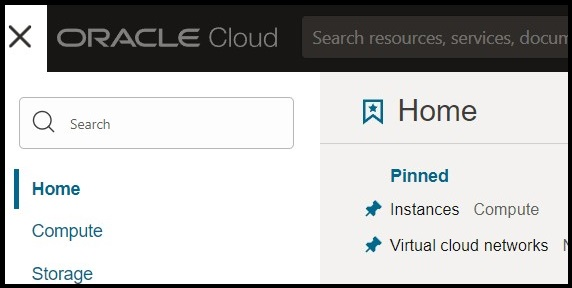
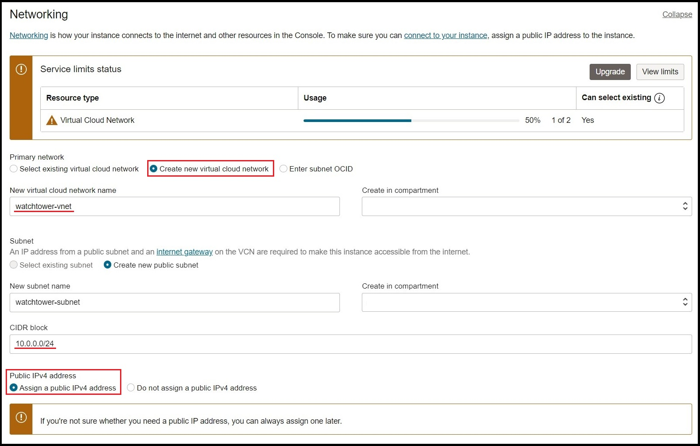
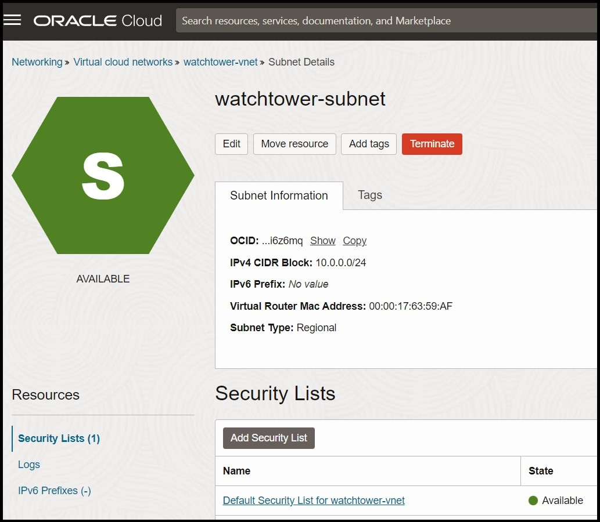
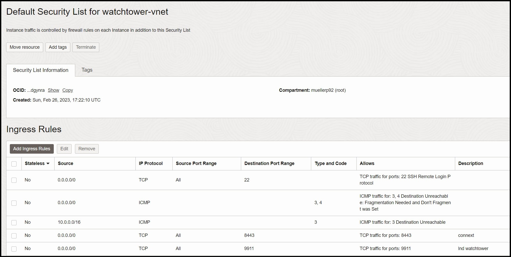

# hydranet-watchtowers

## Run your own Watchtowers for the Hydranet Wallet:

If you're using the Hydranet Multi Currency Lightwallet, you may be concerned about the security of your funds while your wallet is offline.
One way to improve the security of your Lightning and Vector wallet is to use Connext Vector and Lightning Watchtowers, which help prevent against certain types of attacks.
<br>
Watchtowers permanently monitor the blockchain for channel to ensure no fraudulent activity like settling an old channel state happens.
<br>
In this tutorial, we'll walk you through the steps of setting up Connext and Lightning Watchtowers on Oracle Cloud Free Tier, which offers free access to virtual machine instances that are suitable for running these workloads.
<br>
By the end of this tutorial, you'll have a fully functional Connext and Lightning Watchtower setup that can help secure your Wallet. Please note that this tutorial assumes some technical expertise, so be prepared to invest some time and effort into the process.
<br>
Watchtowers can only prevent malicious channel closures, but not change the transaction or access the funds of the wallet they protect.

Two kinds of Watchtowers exist:
- Altruistic watchtowers operate without any financial incentive to do so.
- Reward watchtowers offer protection in exchange for a reward.

<br>
The Watchtowers that will be deployed in this tutorial are both altruistic watchtowers.
<br>

The _Connext Vector_ watchtower **requires the operator to fund the watchtowers wallet** with Ethereum to pay for the gas fees.
<br>
Gas Fees only occur when the watchtower actually has to prevent an attack.
<br>
The Lightning LND watchtower does not need it´s own funds to operate.
<br>
<br>


# Table of Contents
1. [Requirements](#requirements)
2. [Use Oracle Cloud Free tier (Optional)](#optional-use-oracle-cloud-free-tier-skip-this-step-if-you-already-have-a-server)
3. [Run the Watchtower](#run-the-watchtower)
4. [Configure the Watchtower in the Wallet](#configure-the-watchtower-in-the-wallet)

# Requirements:
- ### Linux server (tested with ubuntu 22.04) with a public IP
- ### Docker installation (install script provided by this repo)
- ### SSH client
- ### Watchtowers wallet needs to be funded with Ethereum (ETH) and Arbitrum Ethereum (aETH)
- ### RPC provider for Ethereum and Arbitrum (e.g. Geth, Infura)
<br>

# Optional: Use Oracle Cloud Free tier ([skip this step if you already have a server](#run-the-watchtower))
### 1. Create an Oracle Cloud account
https://signup.cloud.oracle.com/?sourceType=_ref_coc-asset-opcSignIn&language=en_US
### 2. Sign in and select the region you prefer:

### 3. In the dropdown on the left, select "Compute" -> "Instances"

### 4. Create a new instance:

### 5. Select Ubuntu 22.04 and VM.Standard.E2.1.Micro (always free)

### 6. Create a new virtual cloud network and name it "watchtower-vnet"
### 7. Create a new subnet and enter the network address 10.0.0.0/24
### 8. Check the "assign public ip" box.

### 9. Create a new private key and download it. Make sure to save it.

### 10. Finish the VM setup. The VM will now be provisioned.
### 11. Get the public IP of your VM. The username will be ubuntu. You will need the private key from the previous step to login via SSH.

### 12. Go to Networking -> Virtual cloud networks ->watchtower-vnet and click on the Default Security List.

### 13. Click on "Add Ingress Rules" and add two new rules. One for Connext and one for LND watchtower. Port 8443 and 9911.

### 14. Make sure it looks like this when youre done:

### 15. Login to your new server by using an SSH client and the private key.
```sh
ssh -i /home/xxxxx/.ssh/ssh-key-xxxx.key ubuntu@xxx.xxx.xxx.xxx
```
<br>

______
<br>

# Run the Watchtower
## 1. Install docker
#### 1.1 ssh into your machine, clone this repository and install docker:
```sh
sudo su -
git clone https://github.com/hydra-net/hydranet-watchtowers.git
cd hydranet-watchtowers
bash install-docker.sh
```
_This script will update your machine, install docker and docker-compose and run a hello-world test image. You should see the line "Hello from Docker!" if everything runs successful._
<br>
_____

## 2. Edit the watchtower config
#### 2.1. Find the `config.yaml` in your current folder and add the private key of your wallet, that will be used for the watchtower. _This should not be your main wallet._

#### 2.2. Configure the TSL certificate with one of the following options:
 
```bash 
# Option 1: If you want the watchtower to generate its own TLS certificate, leave the following option to true:
generate_self_signed_cert: true
```
```bash 
# Option 2: If you want to bring your own TLS certificate (e.g. Let's Encrypt), set it to false and specify the path to your key and cert:
generate_self_signed_cert: false

tls_cert_path: self-signed-tls.cert
tls_key_path: self-signed-tls.key
```

#### 2.3. Add your chain provider config for ethereum and arbitrum. The number represents the `chain id`:
```
chain_provider_map:
  5: https://goerli.infura.io/v3/xxx
  421613: https://arbitrum-goerli.infura.io/v3/xxx
```

#### 2.4. To control who can access your watchtower, add one or more API keys:
```sh
api_keys:
  - test
  - secret
```
_Anyone with the key can use your watchtower._
<br>
_____

## 3. Run the watchtower
#### 3.1. Run the command `docker-compose`
```sh
docker-compose up -d 
```
Lightning watchtower will now sync the chain using _neutrino_, you dont have to run a full bitcoin node.

#### You can see the logs of the LND Watchtower by executing:
```sh
docker-compose logs -f lnd
```
#### Connext Watchtower does not have to sync anything.
```sh
docker-compose logs -f connext_watchtower
```
#### 3.2. For Connext you have to top up the watchtowers wallet. To get the public address of the watchtower, run:
```sh
bash ./get-connext-address.sh
```
This will also print the URL for use in the MCLW.
<br>
_____

## 4. Configure the LND watchtower

#### 4.1. You have to execute a command to create a wallet for the LND watchtower. The wallet does not need to be topped up, but it needs to be created and unlocked every time the watchtower restarts:
**Make sure you are always in the "hydranet-watchtowers" folder when executing these commands.**
```sh
bash ./setup-lnd.sh
```
#### 4.2. Enter a password for the wallet. When asked for a seed phrase, type "n" and press enter.


_____
<br>

# Configure the Watchtower in the Wallet
#### 1. Use your Watchtowers public ip and the api key from the config to test and save the watchtower in the wallet.

```sh
bash ./get-lnd-info.sh
your watchtower url is:  029b41067bec69bcf3fe9ed1504d5a26713ea9ea74379bf1e50e779d31ae90a8d7@158.101.169.109:9911
```
This will print the watchtower url for use in the wallet.

#### 2. The LND needs to be unlocked after a restart:
```sh
bash ./unlock-lnd.sh
```

#### 3. In the wallet go to settings -> Watchtower and configure your URLs.


#### 4. The Channels tab should show "Protected" after a few minutes. This means that the Watchtower is running successfully!

